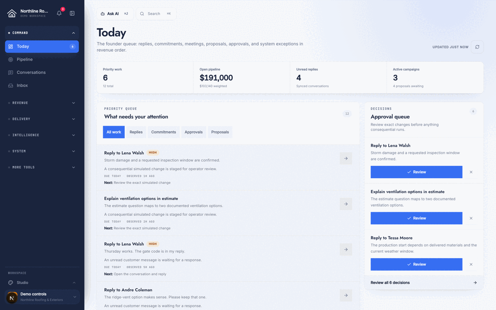

# Accelerate Revenue OS

[](https://github.com/JohnConnorCode/accelerate-site/actions/workflows/ci.yml)
[](LICENSE)

Accelerate Revenue OS is a self-hosted operations platform for service businesses. It runs your pipeline, inbox, campaigns, proposals, and analytics in one application, with AI built into the workflow instead of bolted on top. This is the actual code behind a working business, open-sourced as-is, not a demo trimmed down for GitHub.

Most CRMs rent you a seat in someone else's database and charge more the more you use them. This one you own outright: your own Supabase project, your own AI provider key, your own data. Multi-tenancy is built in from the schema up, so an agency can run several client businesses from a single deployment without any of them seeing each other's records.

[Live site](https://www.acceleratewith.us) · [Interactive fictional demo](https://www.acceleratewith.us/demo/command-center) · [Architecture](docs/ARCHITECTURE.md) · [Self-hosting](docs/SELF-HOSTING.md) · [Roadmap](#roadmap)



> **Project status:** Active and production-derived. The fictional demo works with zero setup and no provider credentials. A connected workspace needs your own Supabase project and, optionally, your own provider accounts. Read the security and tenancy contracts before you put real customer data anywhere near it.

## What it does

**Today** is the operator's front door: one ranked queue, per tenant, of replies, approvals, follow-ups, and anything else that needs a decision right now.

**Records** are canonical. Every contact, company, and opportunity is one entity with one pipeline stage, one owner, and one activity history, so different screens never quietly disagree about the same deal.

**The inbox** resolves identity on intake, so a new message from an existing contact gets merged into their record instead of spawning a duplicate.

**Campaigns, proposals, and bookings** run through approval gates and idempotent sends, so a flaky network or a doubled click never means a client gets the same email twice.

**Analytics** ties revenue back to its source, by channel, campaign, and stage, and shows where attribution data is genuinely missing instead of quietly treating it as zero.

**The AI layer is grounded, not generic.** Every model call runs against bounded, retrieved context with source citations, and every write it proposes goes through the same approval queue and audit trail as a human action. It doesn't get a side door around the rules everyone else follows.

**Tenancy is structural, not bolted on.** One shared database, explicit tenant context on every request, isolated records, and a workspace can connect its own OpenRouter key so AI spend is billed to that tenant, not to you. Five fictional demo workspaces let you explore the entire product, including a live drag-and-drop feature-board kanban, with no setup at all.

See [Roadmap](#roadmap) below for what's shipped, in progress, and planned next.

## Technology

- Next.js 16 and React 19
- TypeScript and Tailwind CSS 4
- Supabase Auth and PostgreSQL
- TanStack Query
- OpenRouter for AI routing
- Resend for email
- Playwright for browser and accessibility coverage

## Quick start

[](https://vercel.com/new/clone?repository-url=https%3A%2F%2Fgithub.com%2FJohnConnorCode%2Faccelerate-site&project-name=my-revenue-os&repository-name=my-revenue-os&demo-title=Accelerate%20Revenue%20OS&demo-description=Self-hosted%20revenue%20operations%2C%20CRM%2C%20and%20AI%20workspace&demo-url=https%3A%2F%2Fwww.acceleratewith.us%2Fdemo%2Fcommand-center)

The button deploys with no environment variables required: it boots straight to the public marketing site and the fictional demo, and any admin route redirects to a clearly labeled "connect your Supabase project" screen instead of erroring. Add your own Supabase project's variables in the new Vercel project's settings when you're ready for a real workspace, then follow [Self-hosting](docs/SELF-HOSTING.md).

This repository ships with automatic Git deployments off (`git.deploymentEnabled: false` in `vercel.json`), which exists to keep the maintainer's own production project on a separate prebuilt release path. It carries over to your fork's Vercel project too, so a `git push` after the first deploy won't redeploy until you turn Git deployments back on in your new project's **Settings → Git**.

Or run it locally instead:

Requirements: Node.js 22+, npm 10+, and Git.

```bash
git clone https://github.com/JohnConnorCode/accelerate-site.git
cd accelerate-site
npm ci
npm run dev
```

Open [http://localhost:3000](http://localhost:3000). The public site and fictional demo are the fastest way to explore the project; neither one touches an external service.

To connect a real workspace instead:

```bash
cp .env.example .env.local
# Add your own Supabase values, then apply the documented migrations.
npm run dev
```

Never copy production credentials into a fork. [Self-hosting](docs/SELF-HOSTING.md) covers migration order, environment tiers, tenant bootstrap, and turning on providers.

## Useful commands

| Command                          | Purpose                                                      |
| -------------------------------- | ------------------------------------------------------------ |
| `npm run dev`                    | Start the local development server                           |
| `npm run build`                  | Create a production build with an immutable release identity |
| `npm run lint`                   | Run ESLint                                                   |
| `npm run typecheck`              | Run TypeScript without emitting files                        |
| `npm run test:core`              | Run the environment-independent contract suite               |
| `npm run verify:oss`             | Check open-source repository hygiene and secret patterns     |
| `npm run qa:admin-demo -- --one` | Exercise one complete fictional workspace in Playwright      |

## Architecture at a glance

```text
Public site / Admin UI / APIs / Cron / Webhooks / AI tools
                         │
                         ▼
       Auth + validation + explicit tenant resolution
                         │
                         ▼
         Revenue OS domain services and action queue
                         │
                         ▼
       Tenant-scoped PostgreSQL + immutable receipts
```

Route handlers and UI components are thin adapters, nothing more. Every business write lives in `src/lib/revenue-os/`, tenant resolution lives in `src/lib/tenancy/`, and every database change is an ordered SQL migration, never a runtime mutation. Read [docs/ARCHITECTURE.md](docs/ARCHITECTURE.md) before you touch any of those boundaries.

## Roadmap

`scripts/feature-backlog-data.mjs` is the single source of truth for what's shipped, in progress, planned, and backlog. Every card carries acceptance criteria, dependencies, and required verification, following the [Feature Board taxonomy](docs/FEATURE-BOARD-TAXONOMY.md). Extend that manifest; don't start a second roadmap in a fork.

[**/roadmap**](https://www.acceleratewith.us/roadmap) renders that manifest publicly, with every card's real description and acceptance criteria, no signup required. A curated, dependency-satisfied subset — cards ready to pick up without waiting on other work — is also mirrored to [GitHub Issues labeled `help wanted`](https://github.com/JohnConnorCode/accelerate-site/issues?q=is%3Aissue+is%3Aopen+label%3A%22help+wanted%22) via `npm run mirror:feature-board-issues -- --apply`.

You can also explore the same kanban UI the founder uses, populated with representative fictional data, inside any [demo workspace](https://www.acceleratewith.us/demo/command-center) under **System → Feature Board**. The live founder board at `/admin/features` requires authentication, so it isn't publicly browsable.

The Deploy with Vercel button above ships `one-click-vercel-deploy`. `guided-first-run-setup` is next: an in-product guided flow to connect Supabase and create the first admin account without a terminal, for the deployment above once you're ready to go beyond the demo.

## Security model

- Server credentials never reach browser bundles, source control, logs, or a database settings row.
- Every operational record carries tenant ownership, enforced by membership checks, request context, and database policy, not by convention.
- External effects (sends, webhooks, provider calls) require deterministic idempotency and end in a terminal receipt, so retries can't double-fire them.
- AI reads run against bounded context only. AI writes and external actions go through the same validated services and approval rules the UI does; there is no separate, looser path for the model.
- Fictional demo workspaces are hard-isolated from production: they can never issue a real, protected request.

Found a vulnerability? Report it privately, as described in [SECURITY.md](SECURITY.md), rather than opening a public issue.

## Contributing

Contributions are welcome. Read [CONTRIBUTING.md](CONTRIBUTING.md) first, follow [CODE_OF_CONDUCT.md](CODE_OF_CONDUCT.md), and keep pull requests narrowly scoped to one change. Anything touching authorization, tenancy, migrations, providers, or automation needs the relevant contract tests and threat-boundary evidence, not just a passing build. Repository-level changes are tracked in [CHANGELOG.md](CHANGELOG.md).

## Branding and assets

The source code is MIT licensed. The Accelerate name, marks, customer and case-study media, photography, marketing copy, and downloadable resources are not covered by that license. If you're publishing a fork, replace them first. See [ASSETS.md](ASSETS.md) for the exact boundary.

## License

Code is available under the [MIT License](LICENSE).
