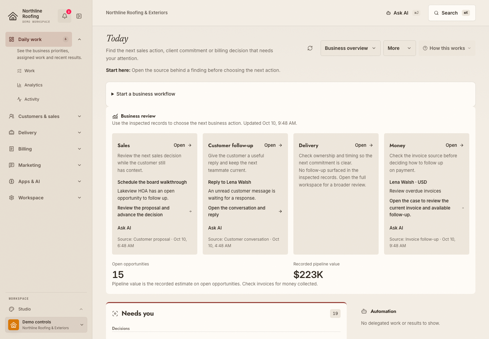

# Accelerate Command Center

[](https://github.com/JohnConnorCode/accelerate-site/actions/workflows/ci.yml)
[](LICENSE)

Command Center is an **open-source AI business platform you can make your own**. Manage customers, sales, delivery, billing and marketing with a shared customer history. Use AI to work with that context, and build the workflows and Apps your business needs on the existing foundation.

**Run your business:** give an inquiry an owner and next action, hand a won opportunity into client onboarding, prepare an invoice and follow unpaid accounts. [Explore the business areas](docs/planning/COMMAND-CENTER-POSITIONING-2026-10-10.md#six-business-areas), or [follow one fictional customer](https://www.acceleratewith.us/demo/command-center/northline-roofing/today?workflow=client).

**Build for your team or clients:** give Claude Code or Codex the repository and a concrete business task. Add screens, reports and workflows using the existing customer identity, permissions and business services. [Adapt a working follow-up report](https://www.acceleratewith.us/docs/extend/first-change) before starting a larger custom App.

Try six fictional businesses without an account or provider keys. When you are ready for your own team, connect a Supabase project and provider accounts you control. The application source is MIT licensed; hosting and provider usage have their normal costs.

**Have an agent build your workflow:** describe the repeated work, the records it uses and the result your team needs. A coding agent can handle setup, source changes, extension registration and checks while you review the working result. Reusing customer identity, permissions and business services saves rebuilding that foundation for every custom screen. Start with [an agent-ready business brief](https://www.acceleratewith.us/docs/extend/ai-authoring).

**Explore available Apps:** [the App and plugin guides](https://www.acceleratewith.us/docs/plugins) cover follow-up reports, onboarding, invoicing, collections, websites, forms and other specialized workflows. Each explains the current behavior, setup and an example you can try. [Compare alternatives](docs/planning/COMMAND-CENTER-POSITIONING-2026-10-10.md#what-the-competition-teaches-us) when deciding between a CRM, a business suite and a custom development platform.

[Live site](https://www.acceleratewith.us) · [Interactive fictional demo](https://www.acceleratewith.us/demo/command-center) · [How it works](https://www.acceleratewith.us/docs/start/how-it-works) · [Architecture](docs/self-hosting/ARCHITECTURE.md) · [Self-hosting](docs/self-hosting/SELF-HOSTING.md) · [Developer start](docs/contributing/DEVELOPER-START.md) · [All docs](docs/README.md) · [Roadmap](#roadmap)



> **Start here:** The fictional demo works with zero setup and no provider credentials. A connected workspace needs your own Supabase project. Verify sign-in, saved records, tenant isolation and backups before importing real customer data.

## Quick start

Give Claude Code or Codex this assignment:

```text
Set up https://github.com/JohnConnorCode/accelerate-site.
Read docs/NORTHSTAR.md, then AGENTS.md. Preserve existing unfinished work.
Install dependencies, run the fictional demo and show me what works.
Then build the business workflow I describe using the existing services.
Run the required checks and show the exact tested source changes.
Hand off deployment separately.
```

The agent handles the commands below. You provide the business rules, authorized account access for connected services and feedback on the working result. [Your first agent-built change](https://www.acceleratewith.us/docs/extend/first-change) explains the handoff.
For version identity and upgrade planning, see [Core releases and fork upgrades](docs/self-hosting/RELEASES.md). Run `npm run release:check` to inspect verified stable metadata; applying an upgrade remains maintainer work.

[](https://vercel.com/new/clone?repository-url=https%3A%2F%2Fgithub.com%2FJohnConnorCode%2Faccelerate-site&project-name=my-revenue-os&repository-name=my-revenue-os&demo-title=Accelerate%20Revenue%20OS&demo-description=Self-hosted%20revenue%20operations%2C%20CRM%2C%20and%20AI%20workspace&demo-url=https%3A%2F%2Fwww.acceleratewith.us%2Fdemo%2Fcommand-center)

The full repository starts with a neutral Command Center homepage and the fictional demo, with no environment variables required. Accelerate agency pages and assets are off by default. Admin routes show a clearly labeled setup screen until you connect your own Supabase project. Follow [Self-hosting](docs/self-hosting/SELF-HOSTING.md) to create your workspace.

In Site Studio, edit the starter's identity, theme, navigation and pages, connect published forms, then preview and publish. The same website document and approval flow support UI editing, AI and owner-authorized ChatGPT MCP. See [Website setup and profiles](docs/self-hosting/NEUTRAL-DISTRIBUTION.md) and [ChatGPT setup](docs/self-hosting/SITE-STUDIO-CHATGPT.md). The optional reduced export is not required to fork the complete product. The fictional demo also supports private page drafts: create, rename, reload and discard a browser-session copy. Private previews use real phone, tablet and desktop viewports with public page styling and inactive links and forms. AI example mode uses a template without a provider call. The installation editor preserves edits through failed reloads, pauses competing save/import actions, and retries the same change when its confirmation cannot be verified.

Client records connect editable agreement details with activity and follow-ups. Each section loads and retries independently, refreshes retain unsaved edits, and new follow-ups refresh Work and Today. See [the Clients guide](src/content/docs/delivery/clients.mdx) for the workflow. Work task links reopen the same inspector after reload, with editable instructions, related-record links and recovery for failed reads or saves.

This is one codebase and one complete product, including our own installation. `NEXT_PUBLIC_DISTRIBUTION_PROFILE=neutral` turns the bundled agency presentation off; `branded` turns it on. Unset defaults to off. Choose the same value at build and runtime, then rebuild and deploy; this is not a live admin toggle. Both profiles retain the full workspace, editor, AI/MCP, plugins and governed business services. Changing profiles does not delete saved website revisions. Hosting ownership is verified separately in [Deployment](DEPLOY.md).

Forks deploy on Git pushes and include no scheduled jobs, so exploring the demo does not require a Pro cron schedule. Enable scheduling only after connecting a workspace and checking your hosting plan. The original installation retains its guarded prebuilt release and schedules through `vercel.production.json`.

Or run it locally instead:

Requirements: Node.js 22.16+, npm 10+, and Git.

```bash
git clone https://github.com/JohnConnorCode/accelerate-site.git
cd accelerate-site
npm ci
npm run dev
```

Open [http://localhost:3000](http://localhost:3000). The public site and fictional demo are the fastest way to explore the project; neither one touches an external service.

To connect a workspace, use your own hosted Supabase project and PostgreSQL client tools (`psql`). Follow [Self-hosting](docs/self-hosting/SELF-HOSTING.md) to configure credentials, create the first owner, and apply the verified migration catalog. External providers can be connected afterward in Setup Center.

Never copy production credentials into a fork.

## What it does

**Today** is the operator's front door: one ranked queue, per tenant, of replies, approvals, follow-ups, and anything else that needs a decision right now.

**Records** are canonical. Every contact, company, and opportunity is one entity with one pipeline stage, one owner, and one activity history, so different screens never quietly disagree about the same deal.

**The inbox** resolves identity on intake, so a new message from an existing contact gets merged into their record instead of spawning a duplicate.

**Campaigns, proposals, and bookings** run through approval gates and idempotent sends, so a flaky network or a doubled click never means a client gets the same email twice.

**Analytics** ties revenue back to its source, by channel, campaign, and stage, and shows where attribution data is genuinely missing instead of quietly treating it as zero.

**AI can work with business records.** It can retrieve bounded customer context, link findings to source records and use registered operations to prepare or execute permitted work. Actions follow the existing permissions, impact tiers and audit trail. Consequential actions require approval.

**Workspace records stay isolated.** Business requests use explicit workspace context and tenant-isolated records. A workspace can connect its own OpenRouter key; provider usage follows the configured credential owner. Six fictional demo workspaces let you explore the product, including a live drag-and-drop feature-board kanban, with no setup at all.

See [Roadmap](#roadmap) below for what's shipped, in progress, and planned next.

## How an agent is allowed to operate it

The rules below are enforced in code, not asked for in a prompt.

**Mutating tools use the action policy.** They stage governed work through the same services as the interface. Eligible actions can earn standing permission after reviewed history; restricted actions retain human review. The tool registry checks declared impact at runtime.

**Execution re-reads reality first.** A proposal expires rather than firing if the record moved underneath it: a contact who unsubscribed, a conversation that was archived, an opportunity already past the stage the proposal assumed.

**Answers cite what they read.** A grounded answer is rejected before it reaches you unless it carries receipts from tools that actually executed in that request. A hallucinated citation fails the check.

**Every external effect is idempotent and ends in a receipt.** Sends, syncs, and webhook deliveries carry idempotency keys, so a retry cannot fire twice and an uncertain outcome is never treated as success.

**Health cannot be quietly green.** Stalled jobs and unread webhook failures surface as degraded rather than being absent from a dashboard.

Every run is traced in `agent_runs` and `agent_run_events` and readable at `/admin/ai`, and every material write lands in the audit ledger at `/admin/activity` with actor, origin, and before/after state.

## Connect your own assistant

The repository ships a Model Context Protocol server. Claude Desktop, Claude Code, ChatGPT's native Connectors, Cursor, and Antigravity connect to a workspace and get the same registered tools, impact tiers and approval controls as the interface. Ask it what's on today's queue, or to mark a task done, snooze it or move an opportunity's stage. Reads return bounded, sourced data. Permissioned routine changes can execute under the existing action rules; consequential actions use the same approval queue as the interface.

Setup for each client is in [docs/self-hosting/MCP-SETUP.md](docs/self-hosting/MCP-SETUP.md).

## Extend it without forking it

For example, an agent can build a client review queue around your existing customer records so the team can find the latest revision and outstanding decision together. That queue is an example to build, rather than a bundled feature. Give the agent the review rules and ask it to demonstrate the complete workflow with fictional records.

The agent implements the business behavior and registers a module, the unit a workspace turns on and off. Its JSON manifest in [`extensions/`](extensions/README.md) declares navigation, routes, AI tools and Setup Center checks. The build validates the manifest as data. The implementation must use shared domain and action services for authorization, approvals and recorded results; registration alone does not implement those operations.

[docs/contributing/EXTENDING.md](docs/contributing/EXTENDING.md) gives the agent the module, integration adapter and AI tool contracts. `extensions/example-inventory.module.json` demonstrates page registration and workspace enablement. Start with [your first agent-built change](https://www.acceleratewith.us/docs/extend/first-change), then review the source and verification evidence before release.

## Technology

- Next.js 16 and React 19
- TypeScript and Tailwind CSS 4
- Supabase Auth and PostgreSQL
- TanStack Query
- OpenRouter for AI routing
- Model Context Protocol for external assistants
- Resend for email
- Playwright for browser and accessibility coverage

## Useful commands

| Command                          | Purpose                                                      |
| -------------------------------- | ------------------------------------------------------------ |
| `npm run dev`                    | Start the local development server                           |
| `npm run build`                  | Create a production build with an immutable release identity |
| `npm run lint`                   | Run ESLint                                                   |
| `npm run typecheck`              | Run TypeScript without emitting files                        |
| `npm run test:core`              | Run the environment-independent contract suite               |
| `npm run verify:oss`             | Check open-source repository hygiene and secret patterns     |
| `npm run qa:admin-demo -- --one` | Exercise one complete fictional workspace in Playwright      |

## Architecture at a glance

```text
Public site / Admin UI / APIs / Cron / Webhooks / AI tools
                         │
                         ▼
       Auth + validation + explicit tenant resolution
                         │
                         ▼
         Revenue OS domain services and action queue
                         │
                         ▼
       Tenant-scoped PostgreSQL + immutable receipts
```

Route handlers and UI components are thin adapters, nothing more. Every business write lives in `src/lib/revenue-os/`, tenant resolution lives in `src/lib/tenancy/`, and every database change is an ordered SQL migration, never a runtime mutation. Read [docs/self-hosting/ARCHITECTURE.md](docs/self-hosting/ARCHITECTURE.md) before you touch any of those boundaries.

## Roadmap

The live Feature Board is the source of truth for current definitions, dependencies, claims and acceptance. `scripts/feature-backlog-data.mjs` contains historical templates; dated reports are orientation, not dispatch authority. Use the [developer handoff](docs/contributing/DEVELOPER-START.md) to inspect and claim an executable card through the canonical protocol.

For coordinated development, a plain-language request is enough: tell any
coding agent to “pick up work from the backlog and go until it is completed and
committed; follow protocol.” The repository entrypoint selects one eligible
card, creates its isolated worktree, supplies the live packet, and continues
through verification and evidence submission. The agent command is an internal
detail (`agent:go`); see [Natural-language agent execution](docs/contributing/NATURAL-LANGUAGE-AGENT.md).

[**/roadmap**](https://www.acceleratewith.us/roadmap) renders that manifest publicly, with every card's real description and acceptance criteria, no signup required. Each card has a stable shareable `/roadmap#roadmap-<seed-key>` link. A curated, dependency-satisfied subset — cards ready to pick up without waiting on other work — is also mirrored to [GitHub Issues labeled `help wanted`](https://github.com/JohnConnorCode/accelerate-site/issues?q=is%3Aissue+is%3Aopen+label%3A%22help+wanted%22) via `npm run mirror:feature-board-issues -- --apply`.

You can also explore the same kanban UI the founder uses, populated with representative fictional data, inside any [demo workspace](https://www.acceleratewith.us/demo/command-center) under **Workspace → Feature Board**. The live founder board at `/admin/features` requires authentication, so it isn't publicly browsable.

For exactly what changed and when, read [CHANGELOG.md](CHANGELOG.md) or the commit history rather than a second, hand-written summary here.

## Security model

- Server credentials never reach browser bundles, source control, logs, or a database settings row.
- Every operational record carries tenant ownership, enforced by membership checks, request context, and database policy, not by convention.
- External effects (sends, webhooks, provider calls) require deterministic idempotency and end in a terminal receipt, so retries can't double-fire them.
- AI reads run against bounded context only. AI writes and external actions go through the same validated services and approval rules the UI does; there is no separate, looser path for the model.
- Fictional demo workspaces are hard-isolated from production: they can never issue a real, protected request.

Found a vulnerability? Report it privately, as described in [SECURITY.md](SECURITY.md), rather than opening a public issue.

## Contributing

Contributions are welcome. Read [CONTRIBUTING.md](CONTRIBUTING.md) first, follow [CODE_OF_CONDUCT.md](CODE_OF_CONDUCT.md), and keep pull requests narrowly scoped to one change. Anything touching authorization, tenancy, migrations, providers, or automation needs the relevant contract tests and threat-boundary evidence, not just a passing build. Repository-level changes are tracked in [CHANGELOG.md](CHANGELOG.md).

## Branding and assets

The source code is MIT licensed. The Accelerate name, marks, customer and case-study media, photography, marketing copy, and downloadable resources are not covered by that license. If you're publishing a fork, replace them first. See [ASSETS.md](ASSETS.md) for the exact boundary.

## License

Code is available under the [MIT License](LICENSE).
